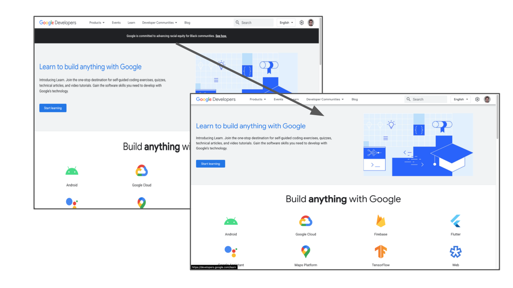

# unwoke

tired of tech companies telling you how woke they are?

unwoke removes helps to remove it from known developer documentation resources

## Usage

1. Open [chrome://extensions/](chrome://extensions/)
2. Click "Load unpacked"
3. Add the unwoke folder. Done!

## Contribute

- Add a PR to block more 
- If you see something, say something: submit an issue and I'll add it for you

